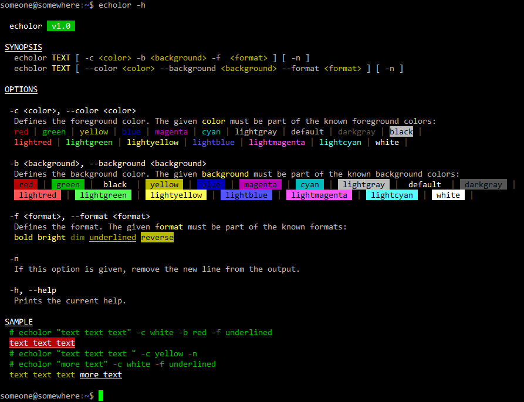

# Echolor 

> A simple Bash colored echo function 



- [Install](#Install) 
- [Usage](#Usage) 
- [License](#License) 


## Install

-  Clone the repo then make sure the binary file is executable:

    ```bash
    $ chmod +x /YOUR_PATH/echolor/bin/echolor
    ```

-  To use it more easily, you could: 
    - deploy the bin file to a bin folder like `/usr/local/bin/` or `/usr/sbin/`:

    >  This task requires **root** or **administrator** permissions.

    ```bash
    ln -s  /YOUR_PATH/echolor/bin/echolor  /usr/local/bin/
    ```

   - or create an `alias`:

    ```bash
    $ alias echolor='/YOUR_PATH/echolor/bin/echolor'
    ```

## Usage

### SYNOPSIS

```bash
echolor <text> [ -c <color> -b <background> -f  <format> ] [ -n ]
echolor <text> [ --color <color> --background <background> --format <format> ] [ -n ]
```
### OPTIONS

Name                        |  Value        | Description 
---------------------       | --------      | --------  
-c \| --color               | `color`       | Defines the foreground color. The given color must be part of the known foreground colors: `red` `green`, `yellow`, `blue`, `magenta`, `cyan`, `lightgray`, `default`, `darkgray`, `black`, `lightred`, `lightgreen`, `lightyellow`, `lightblue`, `lightmagenta`, `lightcyan`, `white`. 
 -b \| --background         | `background`  | Defines the background color. The given background must be part of the known background colors: `red`, `green`, `black`, `yellow`, `blue`, `magenta`, `cyan`, `lightgray`, `default`, `darkgray`, `lightred`, `lightgreen`, `lightyellow`, `lightblue`, `lightmagenta`, `lightcyan`, `white`.
-f \| --format              | `format`      | Defines the format. The given format must be part of the known formats: `bold`, `bright`, `dim`, `underlined`, `reverse`.
-n                          | -             | Do not output the trailing newline.
-h \| --help                | -             | Prints the help.

### SAMPLE

```bash
# print red text
echolor " ERROR " -c red 
echo

# print white text on red
echolor " ERROR " -c white -b red
echo

# print  underlined white text on red
echolor " ERROR " -c white -f underlined -b red
echo

# print a line composed of a white text on red then a yellow text 
echolor " ERROR " -c white -b red -n
echolor " error description" -c  yellow
echo
```

Output:


## License

The MIT License (MIT)

Copyright (c) 2017-2020 Kristuff

Permission is hereby granted, free of charge, to any person obtaining a copy
of this software and associated documentation files (the "Software"), to deal
in the Software without restriction, including without limitation the rights
to use, copy, modify, merge, publish, distribute, sublicense, and/or sell
copies of the Software, and to permit persons to whom the Software is
furnished to do so, subject to the following conditions:

The above copyright notice and this permission notice shall be included in
all copies or substantial portions of the Software.

THE SOFTWARE IS PROVIDED "AS IS", WITHOUT WARRANTY OF ANY KIND, EXPRESS OR
IMPLIED, INCLUDING BUT NOT LIMITED TO THE WARRANTIES OF MERCHANTABILITY,
FITNESS FOR A PARTICULAR PURPOSE AND NONINFRINGEMENT. IN NO EVENT SHALL THE
AUTHORS OR COPYRIGHT HOLDERS BE LIABLE FOR ANY CLAIM, DAMAGES OR OTHER
LIABILITY, WHETHER IN AN ACTION OF CONTRACT, TORT OR OTHERWISE, ARISING FROM,
OUT OF OR IN CONNECTION WITH THE SOFTWARE OR THE USE OR OTHER DEALINGS IN
THE SOFTWARE.
